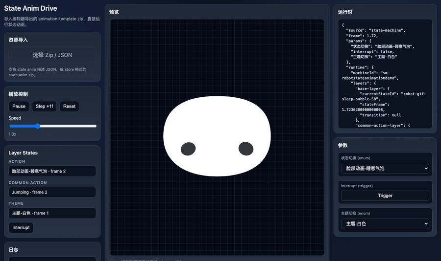
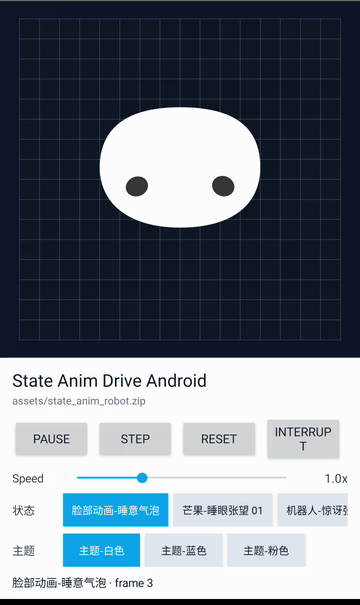

# StateMotionKit

<p>
  <a href="./README.md">English</a>
</p>

<p>
  <a href="./LICENSE"></a>
  
  
</p>

StateMotionKit 是一组用于运行导出状态动画包的独立实验运行时。

它关注一个核心问题：动画模板从编辑器导出后，是否能在普通 Web 页面或 Android 应用里继续驱动同一套状态机、过渡、控制层和矢量路径动画。

## 运行效果

| Web demo | Android demo |
| --- | --- |
|  |  |
| [MP4](./docs/assets/web-demo.mp4) | [MP4](./docs/assets/android-demo.mp4) |

## 特性

- 加载导出的 store zip 格式状态动画包。
- 使用 enum 和 trigger 参数驱动状态机 layer。
- 支持按 layer 播放 state、transition、exit time 和非循环状态完成逻辑。
- 支持 control layer 投影到 motion layer，包括主题和 transform 控制。
- 支持采样 `position`、`scale`、`rotation`、`opacity`、`fill`、`stroke`、`path` 关键帧。
- 同一份导出包可在两个独立运行时里预览：
  - Web demo 使用 SVG 渲染。
  - Android demo 使用自定义 Canvas `View` 渲染。

## 快速开始

### Web

```bash
cd lab-state-anim-drive-js
python3 -m http.server 5211
```

打开 `http://localhost:5211/`，然后在页面里选择 `robot-state-anim.zip` 或其他导出的状态动画 zip。

### Android

用 Android Studio 打开 `lab-state-anim-drive-android`，或者在命令行构建：

```bash
cd lab-state-anim-drive-android
./gradlew assembleDebug
```

Android demo 会读取内置资源：

```text
app/src/main/assets/state_anim_robot.zip
```

生成的 debug APK 位于：

```text
app/build/outputs/apk/debug/app-debug.apk
```

## 项目结构

```text
.
├── README.md                     # GitHub 默认展示的英文说明
├── README.zh-CN.md               # 中文说明
├── lab-state-anim-drive-js/       # 浏览器侧状态动画驱动
│   ├── README.md                  # Web demo 使用说明
│   ├── index.html                 # 页面入口
│   ├── app.js                     # Runtime、包加载、SVG 渲染
│   ├── pathMorphRuntime.js        # 生成的 path morph runtime
│   ├── styles.css
│   └── 技术文档.md
├── lab-state-anim-drive-android/  # Android Canvas demo
│   ├── README.md
│   └── app/src/main/
├── docs/assets/                   # README 演示素材
├── robot-state-anim.zip           # 示例导出包
└── LICENSE
```

## 输入包格式

实验运行时主要面向包含以下文件的导出状态动画包：

- `index.json`
- `state-anim.json`
- 一个或多个 `.state.compiled.json` 文件
- 可选 preview 或 SVG 资源

Web demo 也可以加载兼容的 descriptor JSON。对于引用相对 compiled 资源的本地 JSON，更推荐使用 zip 包，因为浏览器不能自由读取磁盘上的相邻文件。

## Runtime 覆盖范围

当前实验运行时覆盖核心播放链路：

- state 选择与 transition 选择
- 帧推进和速度控制
- trigger 消费
- `exitTime` 和 `onComplete`
- control layer 投影
- path 插值和 path morph fallback
- Android 侧 SVG path 解析

这些实验页不是完整编辑器运行时。像素级效果、Pixi/WebGL 渲染细节、复杂 mask、滤镜和编辑器专用诊断能力可能与源编辑器存在差异。

## 设计目标

- **可移植**：每个 lab 都可以拷贝到其他项目中运行，不直接 import 编辑器源码树。
- **可观察**：runtime 状态应足够透明，便于排查 state transition 和 control layer 投影。
- **保守降级**：暂不支持的编辑器能力应显式暴露或降级，而不是静默失败。
- **可对比**：同一份导出包可以在 Web 和 Android 侧交叉验证。

## 路线图

- 增加基于 fixture 的 descriptor / zip 加载测试。
- 增加常见 state transition 的视觉回归样例。
- 将共享包解析规则整理成更小的 runtime core，并补充文档。
- 增加覆盖 mask、嵌套 frame、复杂 path morph 的导出包。

## 文档

- [English README](./README.md)
- [Web demo 使用说明](./lab-state-anim-drive-js/README.md)
- [Web runtime 技术文档](./lab-state-anim-drive-js/技术文档.md)
- [Android demo 使用说明](./lab-state-anim-drive-android/README.md)

## 许可证

StateMotionKit 使用 [Apache License 2.0](./LICENSE) 发布。
